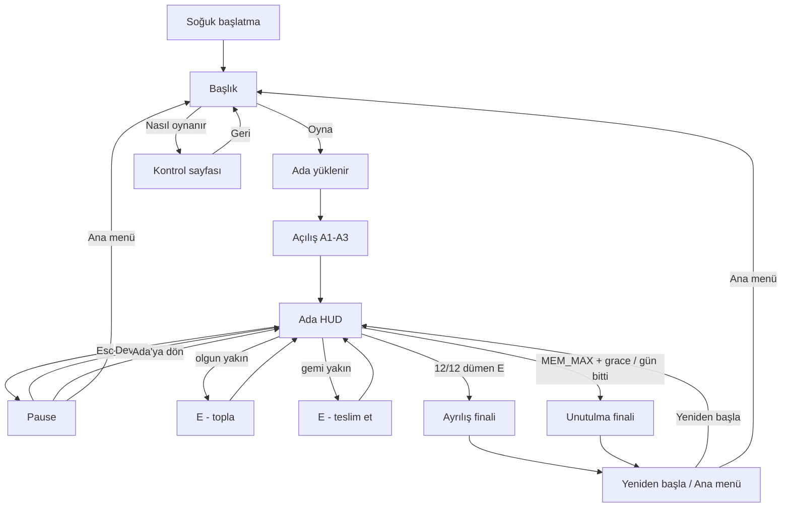

# Kullanıcı akışı — Lotophagoi

> **Durum:** tasarlandı
> **Tarih:** 2026-08-14
> **Girdi:** klavye + fare, tarayıcı masaüstü. Gamepad/touch yok (MVP).
> **Yolculuk haritası:** `design/player-journey.md` henüz yok — bu akış `game-concept.md` duygu sırasını kullanır (sakinlik → fark ediş → hesap → kıl payı hatırlama).

---

## Uçtan uca (soğuk başlatma)

1. **Başlık.** Serin sabah Ege kıyısı (hareketli, oynanmaz). Ortada **Lotophagoi**. Altında Oyna / Nasıl oynanır.
2. **Oyna.** Dünya yüklenir. Oyuncu sığ suda, ayak bileğine kadar — iyileşme bölgesinde, bunu bilmez.
3. **Açılış.** Üç satır, art arda, 3'er saniye (`A1`–`A3`). Konuşan ses yok. Yazı silinir, kontrol geçer. Bundan sonra zorunlu metin ekranı yok.
4. **Ada.** WASD + fare. Olgun pembeyi gör, **E — topla**. Çanta 4 alır. Gemiye **E — teslim et**. Unutuş barı yok; vinyet ve HUD kaybı ölçeği anlatır.
5. **Turlar.** Hedef 12, kapasite 4 → en az üç teslim. Güneş yayı günü gösterir. Eşik 50'de pusula gider; 75'te HUD'un tamamı.
6. **Ayrılış** (12/12, dümende E) **veya Unutulma** (ölçek dolu + grace bitti, ya da güneş battı).
7. **Final.** Üç satır. Skor yok. **Yeniden başla** veya **Ana menü**.

---

## Akış diyagramı

---

## Düğüm tablosu

| Düğüm | Tetik | Ekran | Oyuncu kararı | Sonraki |
|---|---|---|---|---|
| Başlık | boot / ana menü | Title | Oyna / Nasıl oynanır | load veya how |
| Açılış | Oyna | overlay, dünya görünür | yok (3×3 sn) | Ada |
| Ada | kontrol verildi | HUD | topla / teslim / yürü / pause | ada döngüsü veya final |
| Pause | Esc | modal, dünya donuk | Devam / Ada'ya dön / Ana menü | ada veya başlık |
| Ayrılış | U4 kabul | kamera kıç, ada uzaklaşır | Yeniden / Ana menü | ada veya başlık |
| Unutulma | grace bitti veya gün bitti | süt beyazı yükselir | Yeniden / Ana menü | ada veya başlık |

---

## İlk 30 saniye

| sn | Ne |
|---|---|
| 0–2 | Başlık. Oyna'ya Enter veya tık. |
| 2–5 | Yükleme ("Ada yükleniyor…"). Oyuncu suda. |
| 5–14 | A1 → A2 → A3 (3+3+3). Kamera sabit, kontrol yok. |
| 14 | Kontrol. Hint satırı 8 sn: `WASD yürü · fare kamera · E topla / teslim et` sonra solar. |
| 14–30 | İlk olgun lotus kıyı sazlığında görünür mesafede. Oyuncu ya toplar (Beat 1) ya gemiye bakar. |

Açılış **atlanmaz** ilk oyunda. "Yeniden başla" ve pause "Ada'ya dön" açılışı atlar.

---

## Pause / final dönüşleri

- Pause dünyayı **dondurur** (zaman, olgunlaşma, unutuş). Esc tekrar = Devam.
- Final ekranında dünya oynamaz. Unutulma'da karakter durur, etrafına bakar; kontrol alınır.
- Kayıt yok. Ana menü = oturum biter.

---

## Player context (özet)

| Ekran | Duygu (concept §3) | İhtiyaç |
|---|---|---|
| Başlık | merak, sakinlik | isim + tek eylem |
| Ada erken | sakinlik | çiçeği tanı, gemiye dön |
| Ada orta | hesap | rota vs unutuş |
| Ada geç | panik veya huzur | denizi duy, kıyıya in |
| Ayrılış | kıl payı hatırlama | kapanış, skor değil |
| Unutulma | rahatsız huzur | aynı |
