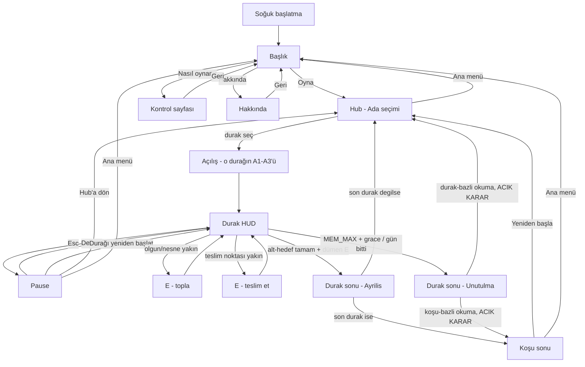

# Kullanıcı akışı — Lotophagoi

> **Durum:** tasarlandı — **Hub eklendi (2026-08-14)**
> **Tarih:** 2026-08-14 (ilk taslak) · güncelleme 2026-08-14 (Başlık → Hub → durak akışı; bkz. `ux/screens.md` üstbilgi ve `CLAUDE.md`)
> **Girdi:** klavye + fare, tarayıcı masaüstü. Gamepad/touch yok (MVP).
> **Yolculuk haritası:** `design/player-journey.md` henüz yok — bu akış `game-concept.md` duygu sırasını kullanır (sakinlik → fark ediş → hesap → kıl payı hatırlama), artık **koşu boyunca 3 kez** (durak başına bir kez) tekrarlanan bir döngü olarak.
> **🔴 K40 (24 Ağu 2026, sahip) — "koşu" kavramı kalktı.** Duraklar **bağımsız**: her durak hub'dan seçilen, kendi başına biten bir oturumdur; aralarında hiçbir durum taşınmaz. Bu dosyadaki üç yer geçersiz: **(1)** üstteki *"koşu boyunca 3 kez tekrarlanan döngü"* — artık her durak kendi başına bir döngü. **(2)** §10'daki "durak kaybı koşuyu bitirir mi" açık kararı **konusuz kaldı** — bitecek bir koşu yok, kayıp her zaman yalnız o durağı bitirir ve oyuncu hub'a döner. **(3)** 8. adımdaki *"Koşu sonu"* dalı ve `ia.md` U6/M4 — **karşılıksız**; her durak kendi Ayrılış'ıyla biter ve hub'a döner, duraklar-üstü bir kapanış ekranı yok. **Kilit modeli de değişti:** `screens.md` §3.3'ün C (Hibrit) kararı yerine **kalıcı kilit** — Lotus'u bir kez bitirmek Kiklop'u kalıcı açar (`localStorage`). Gerekçe: `docs/design/multi-island-concept.md` §10. Aşağıdaki diyagramın "her iki olası sonucu da gösteren" dalları **tek dala indi**: kayıp → hub.
>
> ~~**Not (14 Ağu):** Hub kilit mekanizması ve durak kaybının koşuyu bitirip bitirmediği henüz açık kararlar...~~ — arşiv.

---

## Uçtan uca (soğuk başlatma)

1. **Başlık.** Key art kıyı arkaplanı (durağan, oynanmaz). Ortada **Lotophagoi**. Altında Oyna / Nasıl oynanır / Hakkında.
2. **Oyna.** **Hub**'a (Ada seçimi) girilir — artık doğrudan oyuna değil. Üç durak kartı görünür: Lotus Adası, Kiklop Mağarası, Sirenler Geçidi; kilit/hazır/tamamlandı durumları görünür (bkz. `ux/screens.md` §3.3).
3. **Durak seç.** İlk oynanışta yalnızca Lotus Adası seçilebilir olması muhtemel (kilit mekanizması netleşince kesinleşir). Seçilen durağın dünyası yüklenir.
4. **Açılış.** Üç satır, art arda, 3'er saniye (durağa özgü A1–A3; Lotus için `scenario.md`, diğerleri `island-designer`'ın işi). Konuşan ses yok. Yazı silinir, kontrol geçer.
5. **Durak.** WASD + fare. Olgun pembeyi/durağa özgü nesneyi gör, **E — topla**. Çanta 4 alır. Teslim noktasına **E — teslim et**. Unutuş barı yok; vinyet ve HUD kaybı ölçeği anlatır.
6. **Turlar.** Hedef, durağın kendi alt-hedefi (koşu toplamı 12, durak başına dağıtılmış — bkz. `tuning.md` §3.0, kesinleşmedi). Güneş yayı günü gösterir. Eşik 50'de pusula gider; 75'te HUD'un tamamı.
7. **Durak sonu — Ayrılış** (alt-hedef tamam, dümende E) **veya Unutulma** (ölçek dolu + grace bitti, ya da güneş battı).
8. **Hub'a dön** (Ayrılış'tan, son durak değilse) → 3. adıma dön, sıradaki durağı seç. **Veya Koşu sonu** (son durak Ayrılış'la bittiyse, ya da Unutulma koşu-bazlıysa — bkz. §10 açık karar).
9. **Koşu sonu.** Kapanış metni (henüz yazılmadı). Skor yok. **Yeniden başla** (Hub'a, baştan) veya **Ana menü** (Başlığa).

---

## Akış diyagramı

---

## Düğüm tablosu

| Düğüm | Tetik | Ekran | Oyuncu kararı | Sonraki |
|---|---|---|---|---|
| Başlık | boot / ana menü | Title | Oyna / Nasıl oynanır / Hakkında | hub, how veya about |
| Hub | Oyna / Hub'a dön | Ada seçimi | durak seç / Ana menü | Açılış veya Başlık |
| Açılış | durak seç | overlay, dünya görünür | yok (3×3 sn) | Durak HUD |
| Durak HUD | kontrol verildi | HUD | topla / teslim / yürü / pause | durak döngüsü veya durak sonu |
| Pause | Esc | modal, dünya donuk | Devam / Durağı yeniden başlat / Hub'a dön / Ana menü | durak, hub veya başlık |
| Durak sonu — Ayrılış | alt-hedef + dümen E | kamera kıç, durak uzaklaşır | (son durak değilse) Hub'a dön; (son durak ise) otomatik Koşu sonu | hub veya koşu sonu |
| Durak sonu — Unutulma | grace bitti veya gün bitti | süt beyazı yükselir | **açık karar** — bkz. `ux/screens.md` §10 | hub **veya** koşu sonu |
| Koşu sonu | 3. durak Ayrılış'la bitti (+ olası koşu-bazlı kayıp) | kapanış | Yeniden başla / Ana menü | hub veya başlık |

---

## İlk 30 saniye (Lotus Adası, 1. durak)

| sn | Ne |
|---|---|
| 0–2 | Başlık. Oyna'ya Enter veya tık. |
| 2–4 | Hub. İlk oynanışta yalnızca Lotus Adası seçilebilir (muhtemel — kilit mekanizması netleşince kesinleşir); Enter/tık ile seçilir. |
| 4–7 | Yükleme ("Durak yükleniyor…"). Oyuncu suda. |
| 7–16 | A1 → A2 → A3 (3+3+3). Kamera sabit, kontrol yok. |
| 16 | Kontrol. Hint satırı 8 sn: `WASD yürü · fare kamera · E topla / teslim et` sonra solar. |
| 16–30 | İlk olgun lotus kıyı sazlığında görünür mesafede. Oyuncu ya toplar (Beat 1) ya gemiye bakar. |

Açılış **atlanmaz** ilk oyunda (o durak için). "Durağı yeniden başlat" ve Hub'dan tekrar seçim (bkz. `ux/screens.md` §4) açılışı atlar/atlamaz — küçük bir açık soru, aynı dosyada işaretli.

---

## Pause / final dönüşleri

- Pause dünyayı **dondurur** (zaman, olgunlaşma, unutuş). Esc tekrar = Devam.
- Durak sonu / Koşu sonu ekranında dünya oynamaz. Unutulma'da karakter durur, etrafına bakar; kontrol alınır.
- Kayıt yok. **Ana menü** (Başlık'tan veya Pause'tan) = **tüm koşu** biter, Hub'daki ilerleme gider. **Hub'a dön** (yeni Pause seçeneği) yalnızca şu anki durağı yarım bırakır, koşunun geri kalanına dokunmaz — ikisi artık farklı ağırlıkta, karıştırılmamalı.

---

## Player context (özet)

| Ekran | Duygu (concept §3) | İhtiyaç |
|---|---|---|
| Başlık | merak, sakinlik | isim + tek eylem |
| Hub | seçim, beklenti | üç durağı tanı, hangisine hazır olduğunu anla (kilit/hazır/tamamlandı) |
| Durak erken | sakinlik | nesneyi tanı, teslim noktasına dön |
| Durak orta | hesap | rota vs unutuş |
| Durak geç | panik veya huzur | denizi/durağı duy, güvenli noktaya in |
| Durak sonu — Ayrılış | kıl payı hatırlama | kapanış, skor değil |
| Durak sonu — Unutulma | rahatsız huzur | aynı |
| Koşu sonu | üç durağın toplamına dair bir kapanış | henüz yazılmadı (scenario sahibi) |
